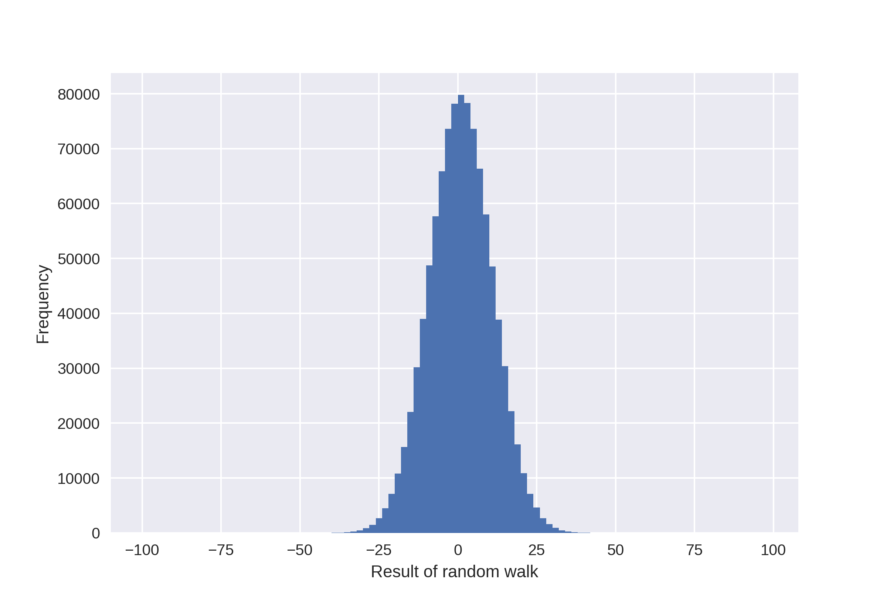

# randomwalk

## Assignment:

Use a computer to implement the following "random walk":

Start at 0. Repeat the following a total of 100 times:
- With 50/50 probability, either add 1 or subtract 1 to/from the current number.
This should yield a number between -100 and 100. Record this number.

Repeat the above for a large number of trials (starting at 0 each time), perhaps 100,000, and record all of the ending values. This will yield 100,000 values that are each between -100 and 100. Produce a histogram of how many times each value (between -100 and 100) arises. Make a nice picture with the x-axis clearly labeled with -100, 100 and any other numbers that seem useful. This picture will go in our book on an upcoming page.

